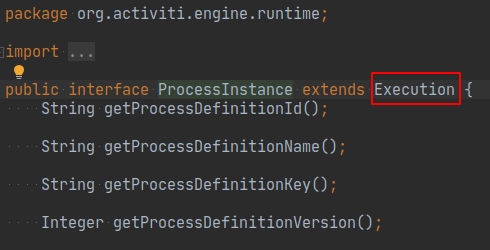
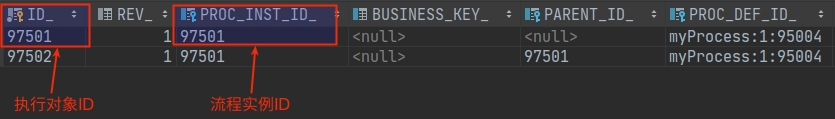
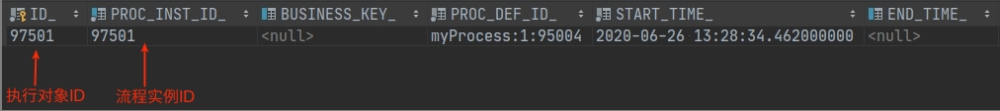
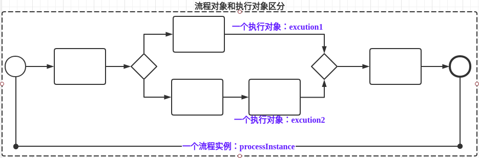
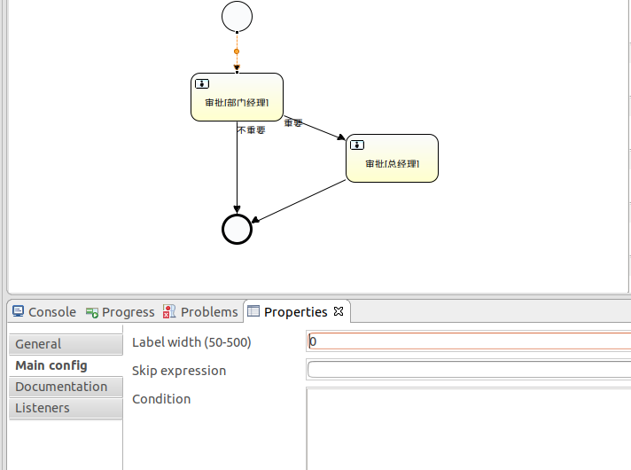
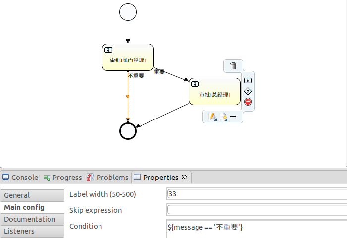
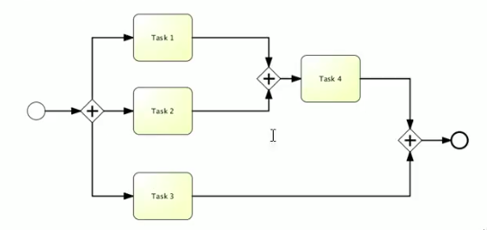
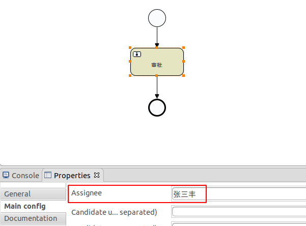
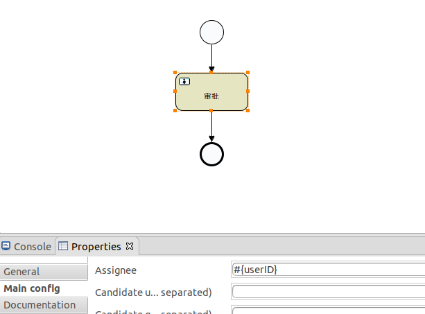
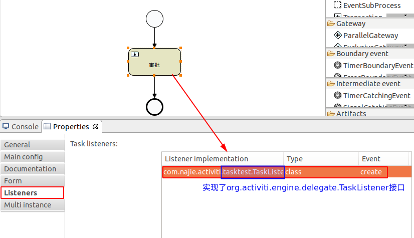

# Activiti

## 流程定义文档（.bpmn文件）
-   bpmn 文件

    流程规则文件，在部署后，每次系统启动的时候都会被解析，
    把内容封装成流程定义放入项目缓存中。activiti 框架结合这个 xml 文件自动管理流程，
    流程的执行就是按照 bpmn 文件定义的规则执行，bpmn 文件是给计算机执行用的。
   
-   展示流程的图片
    在系统里需要展示流程的进展图，图片是给用户看的。

## activiti 默认生产28个数据库表

|		表名	|	    说明		|
|-----------|---------------|
|ACT_EVT_LOG|	            |
|ACT_GE_BYTEARRAY|	|
|ACT_GE_PROPERTY|	|
|ACT_HI_ACTINST|	|
|ACT_HI_ATTACHMENT|	|
|ACT_HI_COMMENT|	|
|ACT_HI_DETAIL|	|
|ACT_HI_IDENTITYLINK|	|
|ACT_HI_PROCINST|	|
|ACT_HI_TASKINST|	|
|ACT_HI_VARINST|	|
|ACT_ID_GROUP|	|
|ACT_ID_INFO|	|
|ACT_ID_MEMBERSHIP|	|
|ACT_ID_USER|	|
|ACT_PROCDEF_INFO|	|
|ACT_RE_DEPLOYMENT|  部署	|
|ACT_RE_MODEL|     	|
|ACT_RE_PROCDEF| 流程定义	|
|ACT_RU_DEADLETTER_JOB|	|
|ACT_RU_EVENT_SUBSCR|	|
|ACT_RU_EXECUTION|	|
|ACT_RU_IDENTITYLINK|	|
|ACT_RU_JOB|	|
|ACT_RU_SUSPENDED_JOB|	|
|ACT_RU_TASK|	|
|ACT_RU_TIMER_JOB|	|
|ACT_RU_VARIABLE|	|

## 核心 API
1. ProcessEngine
2. RepositoryService
3. RuntimeService
4. TaskService
5. HistoryService
6. ProcessDefinition
7. ProcessInstance

   代表流程定义的执行实例，如范冰冰请了一天的假，她就必须发出一个流程实例的申请。
   
   一个流程实例包括了所有的运行节点。
   
   我们可以利用这个对象来了解当前流程实例的进度等信息。
   
   **流程实例就表示一个流程从开始到结束的最大的流程分支，即一个流程中流程实例只有一个**.
   
8. Execution

   Activiti 利用这个对象去描述流程执行的每个节点。
   
   在没有并发的情况下，Execution 就同 ProcessInstance。
   
   **流程按照流程定义的规则执行一次的过程，就可以表示执行对象 Execution。**
   
   见图
   
   
## 管理流程定义(1/2/3/4/5/6)
### 1.部署流程定义
    RepositoryService (仓库服务对象) ： 部署、删除流程定义的服务
    1. 获取流程引擎，通过流程引擎获取一个 RepositoryService(仓库服务对象)
    2. 由仓库服务对象产生一个部署对象配置对象，用来封装部署操作的相关配置
    3. 这是一个链式编程，在部署配置对象中设置显示名，上传流程规则定义文件
    4. 向数据库表中存放流程定义的规则
    5. 这一步在数据库中将操作三张表
        1）act_re_deployment (部署对象表)
           存放流程定义的显示名和部署时间，每部署一次增加一条。
        2）act_re_prodef (流程定义表)   
           存放流程定义的属性信息，部署每一个新的流程定义都会在这张表中增加一条记录。
           注意：当流程定义的 key 相同时，使用的版本升级。
        3）act_ge_bytearray (资源文件表)
           存储流程定义的相关信息，即流程定义文档的存放地。每部署一次就会增加两条记录，
           一条是关于 bpmn 规则的文件，一条是图片（如果部署时只指定 bpmn 一个文件，
           activiti 会在部署的时，解析 bpmn 文件内容自动生成流程图）。
           两个文件不是很大，都是以二进制形式存储在数据库中。

### 2.删除流程定义
    1. 因为删除的是流程定义，而流程定义的部署属于仓库服务的，所以应得到 RepositoryService
    2. 如果删除该流程定义下没有正在运行的流程，则可以用普通删除。如果是有关联的信息，用级联删除。
       项目开发中使用级联删除的情况比较多，删除操作一般只开放给超级管理员使用。

### 3.获取流程定义文件资源（流程图片）
    1. 根据部署ID，从表 act_ge_bytearray 获取资源名称集合;
    2. resourceName 就是 act_ge_bytearray 表中 name 字段的值。
    3. repositoryService().getDeploymentResourceNames(deploymentId); 获取部署下的所有资源名称集合
    4. repositoryService().getResourceAsStream(deploymentId, resourceName); 获取指定部署和资源名名称对应的输入流

### 4.流程定义不能修改，只能更新
    重新部署一个新流程定义，key 值相同，版本号升级

### 5.附加功能
-   查询最新版本的流程定义

-   删除流程定义(删除 key 相同的所有版本的流程定义)

### 6.总结
    Deployment 部署对象
        1. 一次部署的多个文件的信息。对于不需要的流程可以删除和修改。
        2. 对应的表：
            act_re_deployment: 部署对象表
            act_re_procdef: 流程定义表
            act_re_bytearray: 资源文件表
            act_re_property: 主键生成策略表
           
    ProcessonDefinition 流程定义
        1. 解析 .bpmn 文件后得到的流程定义规则的信息，工作流系统就是按照流程定义的规则执行的。
     
### 7.相关的数据库表
    # 部署对象和流程定义相关的表
    select *
    from act_re_deployment; # 部署对象表
    
    select *
    from act_re_procdef; # 流程定义表
    
    select *
    from act_ge_bytearray; # 资源文件表
    
    select *
    from act_ge_property; # 主键生成策略表           

## 流程实例、执行对象、任务
### 1.准备阶段
    部署流程定义 --> 启动流程实例

### 2.涉及几张表
   1. 执行对象表
   
   
   2. 流程实例历史表 
   
   
   3. 流程对象和执行对象区别
   

###  3.办理任务
    在 Activiti 中主要分为两大类查询任务（个人任务和组任务）
    1. 确切指定办理者的任务，这个任务将成为指定者的私有任务，即个人任务。
    2. 无法指定具体某一个人来办理的任务，可以把任务分配给几个人或者多个小组，让这个范围内的用户可以选择性（如果有空余时间）来办理这类任务，即组任务。 
    
    说明：
        1）对于执行完的任务，Activiti 将从 act_ru_task 表中删除该任务，下一个任务会被插入进来。
        
### 4.查询流程状态(判断流程正在执行还是结束)   
   说明：
    1） 在流程执行的过程中，创建流程实例 ID，在整个过程中都不会变，当流程结束后，流程实例将会在正在执行的执行对象表(act_ru_execution)中被删除，转换为历史数据。   
    
### 附加功能
-   查询历史任务
-   查询历史流程实例    

### 结论
   1. 如果是单例流程(没有分支和聚合)，那么流程实例 ID 和执行对象 ID 相同。
   2. 一个流程，流程实例只有一个，执行对象可以有多个(如果存在分支和聚合)。
   3. 一个 Task 节点和 Execution 节点是一对一的情况，在 Task 对象中使用 Execution 来表示他们之间的关系。
   4. 任务历史表和任务表使用相同的ID。

### 总结
   Execution 执行对象
   
   > 按照流程定义的规则执行一次的过程。
   
   对应的表：
   -    act_ru_execution: 正在执行的信息
   -    act_hi_procinst: 已经执行完成的历史流程实例信息
   -    act_hi_actinst: 存放历史所有完成的活动
   
   ProcessInstance 流程实例
   > 特指流程从开始到结束的那个最大的执行分支，一个执行的流程中，流程实例只有一个。
    
   注意
   -    如果是单例流程，执行对象 ID 就是流程实例 ID。
   -    如果一个流程有分支和聚合，那么执行对象 ID 和流程实例 ID 就不相同。
   -    一个流程中，流程实例只有一个，执行对象可以存在多个。
   
   Task 任务
   
   > 执行到某任务环节时，生成的任务信息。

   对应的表：
   -    act_run_task: 正在执行的任务信息
   -    act_hi_taskinst: 已经执行完成的历史任务信息
   
### 相关的数据库表
    # 流程实例 执行对象 任务 相关表
    select *
    from act_ru_execution; # 正在执行的执行对象表
    
    select *
    from act_hi_procinst; # 流程实例的历史表
    
    select *
    from act_ru_task; # 正在执行的任务表(只有节点是 userTask 的时候，该表中才存在数据)
    
    select *
    from act_hi_taskinst; # 任务历史表(只有节点是 userTask 的时候，该表中才存在数据)
    
    select *
    from act_hi_actinst; # 所有活动节点的历史表
    
## 流程变量
> 流程变量在整个工作流中扮演很重要的作用。
> 例如：请求流程中有请假天数、请假原因等一些参数都为流程变量的范围。
> 流程变量的作用域范围是只对应一个流程实例。
> 也就是说，各个流程实例的流程变量是互不影响的。
> 流程实例结束以后，流程变量还保存在数据库中。

### 1.流程变量作用
-   用来传递业务参数
-   指定连线完成任务(同意和拒绝) 
-   动态指定任务的办理人

### 2.流程变量类型(Variable Types)
| Type_name	| Description|
|-----------|------------|
|string     |Value is threaded as a java.lang.String. Raw JSON-text value is used when writing a variable.|
|integer    |Value is threaded as a java.lang.Integer. When writing, JSON number value is used as base for conversion, falls back to JSON text.|
|short      |Value is threaded as a java.lang.Short. When writing, JSON number value is used as base for conversion, falls back to JSON text.|
|long       |Value is threaded as a java.lang.Long. When writing, JSON number value is used as base for conversion, falls back to JSON text.|
|double     |Value is threaded as a java.lang.Double. When writing, JSON number value is used as base for conversion, falls back to JSON text.|
|boolean    |Value is threaded as a java.lang.Boolean. When writing, JSON boolean value is used for conversion.|
|date       |Value is treated as a java.util.Date. When writing, the JSON text will be converted using ISO-8601 date format.|
|binary     |Binary variable, treated as an array of bytes. The value attribute is null, the valueUrl contains an URL pointing to the raw binary stream.|
|serializable|Serialized representation of a Serializable Java-object. As with the binary type, the value attribute is null, the valueUrl contains an URL pointing to the raw binary stream. All serializable variables (which are not of any of the above types) will be exposed as a variable of this type.|    

### 3.查询流程变量的历史表
1. 流程历史变量查询，指定流程变量的名称，查询 act_hi_varinst 表。 

### 4.扩展知识
1. setVariable：设置流程变量的时候，流程变量的名称相同的时候，后一次的值替换前一次的值。而且可以看到 TASK_ID 字段不会存放任务 ID 的值。
2. setVariableLocal：
   -    设置流程变量的时候，针对当前活动的节点设置流程变量，如果一个流程变量中存在2个活动节点，对每个活动节点都设置了流程变量，
        即流程变量的名称相同，后一次的版本的值也不会替换前一次的版本值，它会使用不同的任务 ID 作为标识，存放2个流程变量值，而且可以看到 TASK_ID 
        的字段会存放任务 ID 的值。
   -    还有，使用 setVariableLocal 说明流程变量绑定了当前的任务，当流程继续执行时，下一个任务获取不到这个流程变量(因为正在执行的流程变量中没有这个数据)
        所有查询正在执行的任务时，不能查询到我们需要的数据，此时需要查询历史的流程变量表。
        
### 5.总结
1. 流程变量的作用域就是流程实例，所以只要设置了就行，不用管在哪个阶段设置了。
2. 基本数据类型设置流程变量，在 TaskService 中使用任务 ID，定义流程变量的名称，设置流程变量的值。
3. Javabean 类型设置流程变量，需要这个 Javabean 实现了 Serializable 接口
4. 设置流程变量的时候，向 act_ru_variable 这个表添加数据。
5. 流程变量的获取是针对流程实例的，每个流程实例获取的流程变量不同。
6. RuntimeService 对象可以设置流程变量和获取流程变量。
7. TaskService 对象可以设置流程变量和获取流程变量。
8. 流程实例启动的时候可以设置流程变量。
9. 任务办理完成的时候可以设置流程变量。
10. 流程变量可以通过 key/value 形式设置单个流程变量。
11. 流程变量可以通过Map，同时设置多个流程变量。Map'key = 流程变量的名称，Map'value = 流程变量的值。

## 流程执行历史记录
### 1.查询历史的流程实例
### 2.查询历史活动
### 3.查询历史任务
### 4.查询历史流程变量
### 5.总结
1. 由于数据库中保存着历史信息以及正在运行的流程实例信息，在实际项目中对已完成的任务的查看频率远不及对代办和可接任务的查看，
   所以在 Activiti 才用分开管理，把正在运行的交给 RuntimeService、TaskService 管理，而历史数据交给 HistoryService 管理。
   这样做的好处，加快流程执行的速度，因为正在执行的流程表中的数据不会很大。
   
## 流程连线
### 总结
1. 一个活动可以指定一个或多个 SequenceFlow (Start 中有一个，End 中没有)
   -    开始活动中只能有一个 SequenceFlow
   -    结束活动中没有 SequenceFlow
   -    其他活动中有 1条或多条 SequenceFlow
2. 如果只有一个，则可以不使用流程变量设置 condition 的名称。
   
   如果有多个，则需要使用流程变量设置 condition 的名称，message 表示流程变量的名称，
   '不重要'表示流程变量的值，${} 中间的内容要使用 boolean 类型的表达式，用来判断应该执行的连线。
   
   
## 网关
### 1.排它网关(Exclusive GateWay)  
#### 总结  
1. 一个排它网关对应一个以上的顺序流
2. 由排它网关流出来的顺序流都有一个 conditionExpression 元素，在内部维护返回 boolean 类型的决策结果。
3. 决策网关只会返回一条结果，当流程执行到排它网关时，流程引擎会自动检索网关出口，从上到下检索如果发现第一条决策结果为 true 或者没有设置条件的(默认成立)，则流出。
4. 如果没有任何一个出口符合条件，则抛出异常。
5. 使用流程变量，设置连线条件，并按照连线的条件执行工作流，如果没有条件符合，则以默认的连线离开。
    
### 2.并行网关(Parallel GateWay)         
#### 总结
1. 一个流程中流程实例只有一个，执行对象有多个。
2. 并行网关的功能是基于进入和外出的顺序流的;
   -    分支(fork): 并行后的所有外出顺序流，为每一个顺序流都创建一个并发分支。
   -    汇集(join): 所有到达并行网关，在此等待进入分支，直到所有进入顺序流的分支都到达以后，流程就会通过汇聚网关。
3. 并行网关的进入和外出都是使用相同的节点标识。
4. 如果同一个并行网关有多个进入和外出顺序流，它就同时具有了分支和汇聚的能力。
   这时，网关会先汇聚所有进入的顺序流，然后再且分成多个并行分支。
   
5. 并行网关不会解析条件。即使顺序流定义的条件，也会被忽略。
6. 并行网关不需要是"平衡的"(比如：对于并行网关的进入和外出节点数目不一定相等)。
   
   

## 开始活动节点
### 总结
1. 结束节点是没有出口的。
2. 其他节点有一个或多个出口。
   如果有一个出口，则代表单线流程;
   如果有多个出口，则代表是开启并发流程;   
   
## 接收任务(receiveTask,即等待活动)
> 接收任务是一个简单的任务，它会等待对应消息的到达。当前，官方只实现了这个任务的 java 语义。
> 当流程到达接收任务，流程状态会保存到数据库中。
>
> 在任务创建后，意味着流程进入等待状态，直到引擎收到一个特定的消息，这会触发流程穿过接收任务继续执行。
### 总结
1. 当前任务(一般指机器自动完成，但需要消耗一定时间的工作)完成后，向后推移流程，可以调用(runtimeService.trigger(executionId):传递接收执行对象的 ID)
   
## 个人任务
### 1.直接指定任务办理人

### 2.通过流程变量指定任务办理人

### 3.通过任务监听子类指定办理人

### 4.总结
1. 在类中使用 delegateTask.setAssignee(assignee); 的方式分配个人任务的办理人。
2. 通过 processEngine.getTaskService().setAssignee(taskId, userId); 将个人任务从一个人分配给另一个人。
3. 在开发中，可以将每个任务的办理人规定好，例如：张三的领导是李四，李四的领导是王五，这样张三提交的任务，就可以查询出
   张三的领导李四，通过类的方式设置下一个任务办理人。
   
## 组任务
### 1.涉及的表
1. 正在执行的任务办理人表(act_ru_identitylink)  
2. 历史任务办理人表(act_hi_identitylink)
### 2.个人任务与组任务却别
1. 如果是个人任务，TYPE 类型表示 participant(参与者)
2. 如果是组任务，TYPE 类型表示 candide(候选者) 和 participant(参与者)。
### 3.分配个人任务的方式一：直接指定办理人
### 4.分配个人任务的方式二：使用流程变量
### 5.分配个人任务的方式三：使用任务监听类

## 工作流定义的角色组
### 

   

   

   
   
      